# e-flux_scraping_coexhibition_networks
 Project work at the Central European University, collecting data about contemporary art exhibitions from the website [e-flux](https://e-flux.com/), creating connections between museum, artists.

Artem Timonov, Mihaly Hanics, Sebastian Štros 
Central European University, Vienna - Data Science MSc
## <u> **Description:**</u>

In this work, we focus on collecting information on artists and their exhibitions. We create networks based on the coexhibitions of artists, which we then further analyze. This repository contains the methods for collecting the artists, cleaning and preprocessing, gathering the coexhibitions and creating a network of coexhibitions which then we analyze.

We gathered the artists and the coexhibitions between them according to the [e-flux website (announcements)](https://www.e-flux.com/announcements/). We have collected ~22k artists, among which around 8800 were selected furthermore as contemporary. To gather the artists, we first manually opened the website (to trigger JS scripts) and saved the updated HTML into a file, which we then parsed. From that, we had a list of the artists, using which we could open the artist subpages under [e-flux.com/announcements/?p[]="artist_name"](https://www.e-flux.com/announcements/?p[]=A.K.%20Burns) to gather the exhibitions of the artist. After going through all artists, collecting their exhibitions (storing every artists' exhibitions in a single JSON file, and some data about the exhibition), we looked for matches between artists, and connected the two if they had a common exhibition. Networks of artists were created based on these connections. Data is stored in the [`data` subfolder](https://github.com/me9hanics/e-flux_scraping_coexhibition_networks/tree/main/data), procedures are stored in notebooks, numbered by the order of execution. 
Functions are stored in two files: [`scraping_functions.py`](https://github.com/me9hanics/e-flux_scraping_coexhibition_networks/blob/main/scraping_functions.py) where the functions used for gathering the data are stored, and [`graph_functions.py`](https://github.com/me9hanics/e-flux_scraping_coexhibition_networks/blob/main/graph_functions.py) where the functions used for creating the networks are stored.

This work is part of a bigger project, aiming to understand more about networks of painters and artists, and the structure of these networks. The bigger project, on which we build in the `5_community_detection.ipynb` notebook by using one end-product dataset, split into two parts. One part focuses on data gathering and cleaning of mostly painters, on the largest scale possible (possibly the hardest task and is still not complete, as alias instances and many others need to be combined), this is stored in the GitHub repository [PainterPalette](https://github.com/me9hanics/PainterPalette). The other part is the analysis. Some analysis of styles, movements, style and movement "networks", static and dynamic networks of painters, was done last semester, stored on GitHub: [ArtProject](https://github.com/me9hanics/ArtProject), we gained inspiration from these too. 

In this particular work, we wanted to gain insights about what common properties do artists have, that were connected by coexhibitions. What communities can we find among them? Are these communities fairly even in percentage of females, or vary a lot? From very simple analysis before (in [ArtProject](https://github.com/me9hanics/ArtProject)), we found that centuries ago the surroundings of a painter pretty much determined his/her artistic style too (social contagion). As transportation infrastructure developed (assumably that is the reason), the various styles started spreading more, and while location (in time) used to be a good indicator of an artistic style, it does not have as much of an impact anymore.  
We aim to find similar findings, by analyzing the communities directly in such a network. The final community structure, with some explanation will be a visualized nested blockmodel, from which we can also gain further insights, such as whether intra-community connections are stronger than inter-community ones (hinting at assortivity). 
Analysis of the announcements list of museums-institutions to find association rules was also done, and we look into trajectories of artists based on museum exhibitions.

## <u> Overview of the data collection:</u>

[e-flux](https://e-flux.com/) is a website that provides information about (contemporary) art exhibitions, events, and other art-related news. It stores the announcements under its [announcements](https://www.e-flux.com/announcements/) section, providing basic information of the announced event with date, title and a description (that only the announcement's subpage).

    

 

Exhibitions among these announcements also have artists and institutions listed. We can therefore obtain for each exhibition its date, title, artists and institutions associated with it.

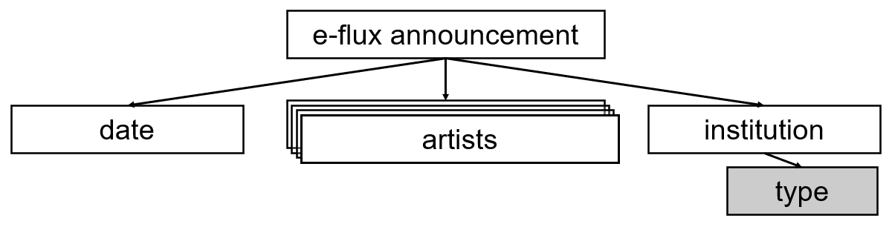

 

We take raw data manually of artist names from the website, downloading it (HTML file), parsing it (`BeautifulSoup` and simple string parsing), cleaning it (remove non-human instances e.g. museums, or in other case select those only) to get a proper list of artist names.  
We then use this list to scrape the exhibitions (stored as announcements) of each individual artist, and storing each in a single JSON file.

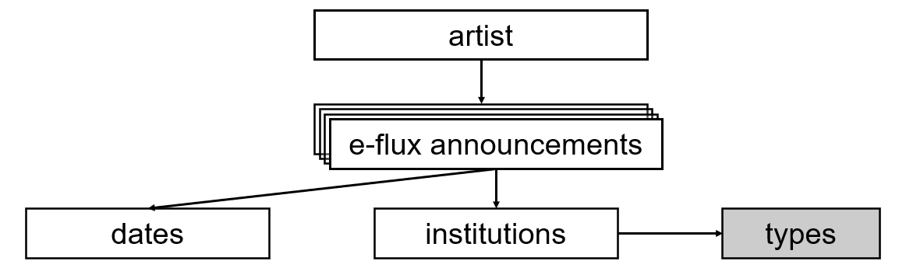

 

We then look for common exhibitions between artists, and create networks of coexhibitions. These are then analyzed: community detection, announcement associations, artist trajectories.

    
<b>Roadmap:</b>

    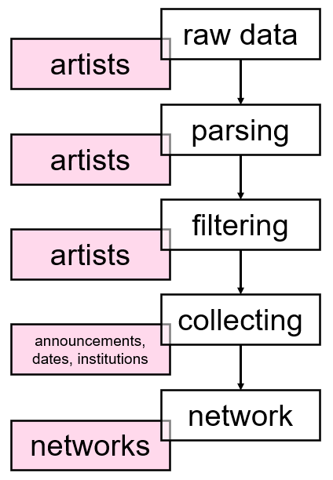

## <u> Detailed procedure description:</u>

1) **Scraping artists**

Firstly, we opened the website, under announcements opened the list of artists. This click runs the Javascript code that puts all the artists into the HTML file of the webpage. From then on, we could open the code by hovering over an artist's name, and inspecting the element (F12).

    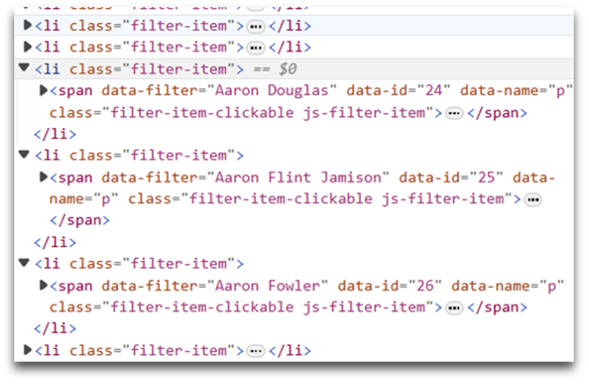

We get a bunch of divs, storing the artist names. We copied the outer element (which stores all of these inside itself), and saved it into the `sources/js_artists_curators_all.txt` file. 
We did similarly with contemporary artists (collected them too separately, for further analysis), before inspecting the artists, we selected 7 contemporary exhibition categories, subsetting only those artists who were active in at least one of these categories. The categories are: "Contemporary Art", "Data & Information", "Installation", "Mixed Media", "Posthumanism", "Postmodernism" and "Technology". These artists are stored in the `sources/js_artists_curators_contemporary_extended.txt` file (those who have exhibitions under "Contemporary Art", a smaller group of artists, were stored in `sources/js_artists_curators_contemporary.txt`).

2) a) **Processing the list of artists**

Taking the files, we search for the spans that have class identical to what we see on the picture above.

    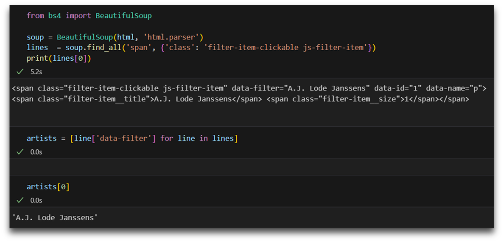

The end results are then stored in the files: `data/eflux_artists.txt`, `data/eflux_artists_contemporary_extended.txt` and `data/eflux_artists_contemporary.txt` (for contemporary artists).

2) b) **Filtering the artists and museums**

If we look into the artist list now, many of the instances are museums, institutions, galleries and so on. Therefore, we need to filter these out for the pure artist list, and also to have a separate list of these only. But how do we do that non-manually? 
Well, one way is to filter out anything that has "museum", "gallery", "university" or "institution" in its name. These are not all the cases however, we need to find all common words in non-artists to filter out the majority of wrong instances. For that, let's split each instance into words, and count the frequency of each word (converting everything into lowercase):

    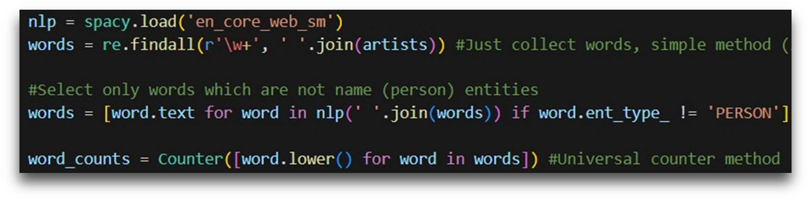
    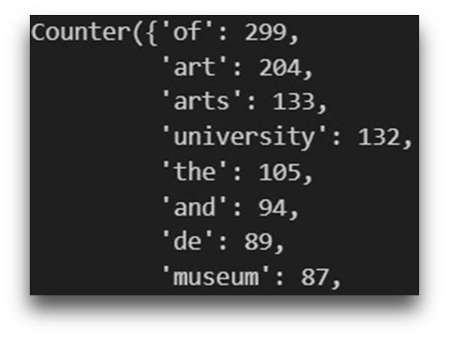
    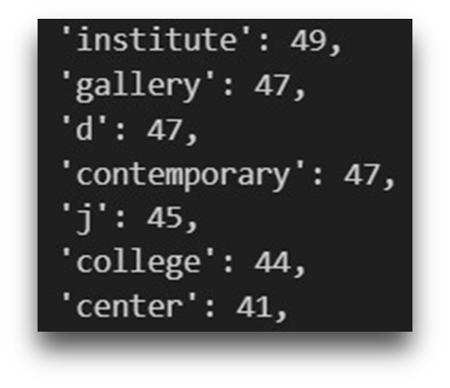

We added an extra criteria for finding the most common words: only select words that do not have entity type "PERSON" (SpaCy library, NLP Named Entity Recognition tool). This way we do not have to look through names among words, such as Michael, James, and so on. 
The end result included many common words we could filter out, which we did. It also included some false cases, like "J." or "Anna" (for some reason, not a "PERSON" entity), so we manually decided on the common ones. The list of filtered words: 

    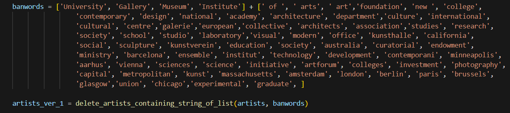

 

The final lists of artists are stored in the `data/artists_cleaned_v1.txt` and `data/artists_cleaned_contemporary_v1.txt` files.

3) a) **Collect exhibitions of artists**

To collect the exhibitions of a certain artist, we gather data from the artist's subpage, e.g. for A. K. Burns:

    

From here, we can just make an HTTP request to gather the HTML of the page, which we then parse to get the exhibitions listed under the artist. This works most of the time, however, for some cases, a certain artist has so many exhibitions (above 30), not all of them are loaded directly, only after scrolling down enough. For these cases, to gather all exhibitions we used Selenium to open a separate (Firefox) webdriver and scroll down until all exhibitions were loaded, then get the HTML of the webpage, which finally included all exhibitions. Using Selenium is slow however, for one artist to gather the exhibitions it could take well over 10 seconds, which in the case of 20000 artists is not feasible. We opted for an optimized solution: we first gather the artist's announcements through a simple HTTP request (takes a fraction of a second), then we check if it is 30 (the maximum number without loading more by scrolling), if yes, we try again by using Selenium. This and other optimizations in `get_announcements_of_artists_scroll_if_needed` (in `scraping_functions`) lead to a much faster process, requiring only ~5-6 hours to get every exhibition for each artist.

After gathering an artist's subpage's HTML file containing all exhibitions, we parse it to get the exhibitions listed in a similar manner as we did to get the artists previously. Furthermore, we also look for classes, divs that store the title, subtitle, announcement date, ID, link. We do this in a loop for each artist, and gather the data in a dictionary. The keys of the dictionary are the artist names, for each artist, the value to the key is a list of exhibitions the artist contributed to. Each exhibition is stored as a (nested) dictionary, containing the ID, link, title, subtitle, announcement date, title artist if available.

    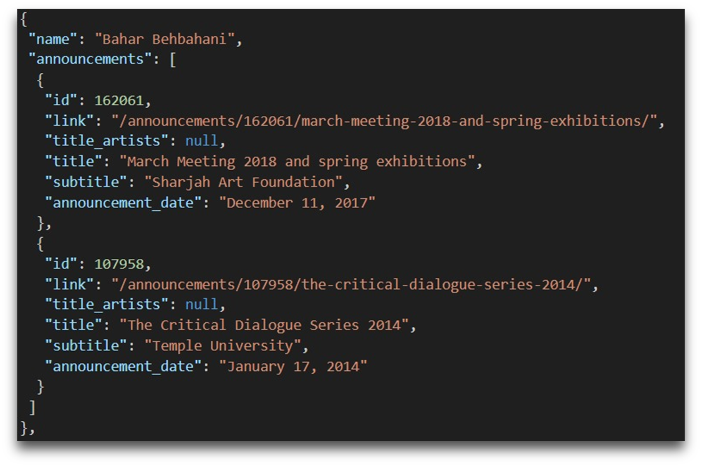

Some problems were caused for some artists with subtitles, and some exhibitions appeared with the same ID but minor differences in title/subtitle, these were all handled. 
The dictionaries are then stored in JSON files: `data/artist_announcements_dict` and `data/artist_announcements_dict_contemporary`.

We store the exhibitions in a JSON file, where each artist has its own JSON file, containing the exhibitions of the artist.

3) b) **Getting the artists of an exhibition**

Now we swapped the keys and values: we built a dictionary of exhibitions, containing data and the list of artists of the exhibition. We removed duplicates and handled other minor special problems.

The dictionary are stored in `data/announcements.json` and `data/announcements_contemporary.json`.

4) **Creating the network of coexhibitions**

Using the `graph-tool` library, and functions in `graph_functions.py`, we firstly created a large network of artists, where two artists are connected if they have a common exhibition. We then created two smaller networks: one where two artists are only connected if they share two common exhibitions (this network was in the end not analyzed) and one where only a subset of artist are included, who are in [PainterPalette](https://github.com/me9hanics/PainterPalette) (the said before project, which has a lot of data (e.g. nationality, locations, style, movement, birth and death year, gender) about painters and some other artists). The intersection of the two datasets include around 1000~ artists, with 53000 connections between them.

The two networks are saved in the `data` folder as `coexhibition_network.gt.gz` and `coexhibition_network_selected_artists.gt.gz` (the official documentation recommends saving the graph in binary format, for perfect reconstruction, hence the gzip archive format).

5) **Analysis**

The separate notebooks describe the exploration process of analyzing the network of coexhibitions, artist trajectories, looking for data mining association rules and detecting communities. Below is a picture of 47 separate communities, based on the nested blockmodel algorithm.

    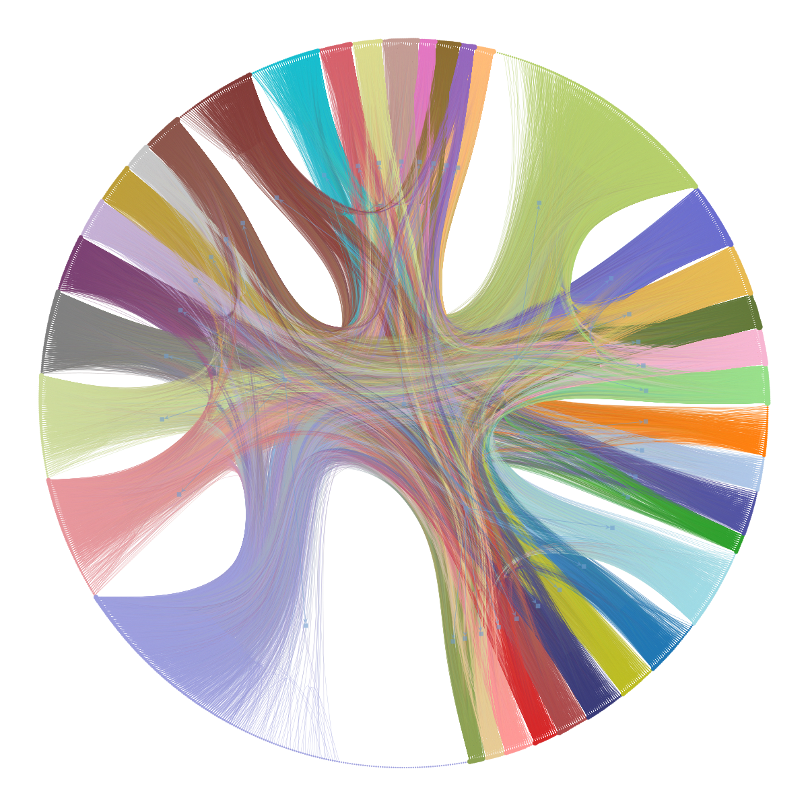

## <u> **Notebooks:**</u>
1. `1_artist_gathering.ipynb` - gathering the artists from the e-flux website
2. `2_artist_cleaning.ipynb` - preprocessing the artists list
3. `3_collect_artist_announcements.ipynb` - gathering the exhibitions of the artists
4. `4_network_building.ipynb` - creating the network of coexhibitions
5. `5_artist_trajectory_network.ipynb` - artist trajectories based on museum exhibitions
6. `5_community_detection.ipynb` - community detection in the network of coexhibitions
7. `5_association_rules.ipynb` - association rules from announcements
